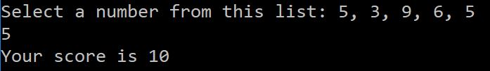
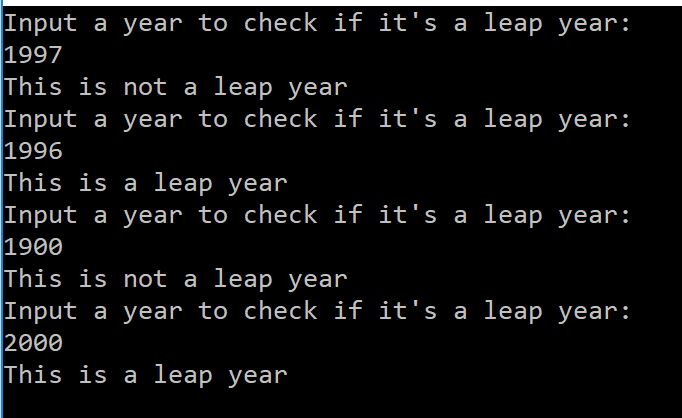
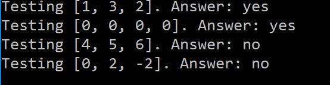
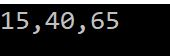

# Prework-CodeChallenges
Code Challenges for Code Fellows 401 ASP.NET Pre-Work

# Problem 1: Array Max Result
Given an array select a number that exists, and output the computated "score". 
The method you create should take in both an array of integers and the integer the user selected.
Create a Console application that requests 5 numbers between 1-10. 
Output the array to the console and Ask the user to select a number. 
After the selection, output the "score" of the number chosen.

Screenshot:

# Problem 2: Leap Year Calculator
Given a year, report if it is a leap year.

The tricky thing here is that a leap year in the Gregorian calendar occurs:

on every year that is evenly divisible by 4
  except every year that is evenly divisible by 100
    unless the year is also evenly divisible by 400

For example, 1997 is not a leap year, but 1996 is. 1900 is not a leap year, but 2000 is.

Screenshot:

# Problem 3: Perfect Sequence
Given a sequence. Return "Yes" if the sequence is considered a perfect sequence. Otherwise, return "No"

Screenshot:

# Problem 4: Sum of Rows
Given a matrix of integers. Return the sum of each row in a single dimensional array.

Screenshot:

